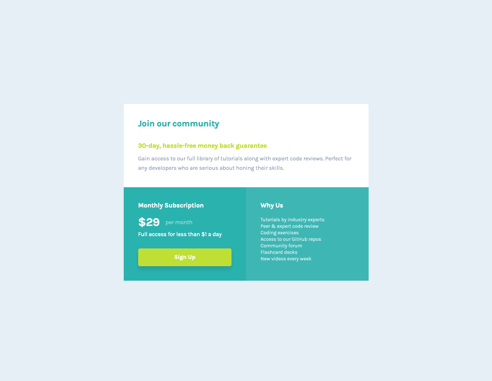

# Frontend Mentor - Single price grid component solution

This is a solution to the [Single price grid component challenge on Frontend Mentor](https://www.frontendmentor.io/challenges/single-price-grid-component-5ce41129d0ff452fec5abbbc). Frontend Mentor challenges help you improve your coding skills by building realistic projects.

## Table of contents

- [Overview](#overview)
  - [The challenge](#the-challenge)
  - [Screenshot](#screenshot)
  - [Links](#links)
- [My process](#my-process)
  - [Built with](#built-with)
  - [What I learned](#what-i-learned)
  - [Continued development](#continued-development)
  - [Useful resources](#useful-resources)
- [Author](#author)

## Overview

### The challenge

Users should be able to:

- View the optimal layout for the component depending on their device's screen size
- See a hover state on desktop for the Sign Up call-to-action

### Screenshot

### Links

- View Code: [Github](https://github.com/darpots/fm-single-price-grid)
- Live Site URL: [Example on Netlify](https://kind-goldwasser-a93aeb.netlify.app/)

## My process

I started by working out how many seperate sections I would require, then built a grid for the large screen version of the site.

### Built with

- Semantic HTML5 markup
- CSS custom properties
- CSS Grid
- Mobile-first workflow

### What I learned

Made the site fully responsive regardless of the users base font-size. Used a mobile first workflow and then added CSS Grid for large screen users. Used CSS Grid which I had only used once before.

### Continued development

I will continue with the mobile first and responsive philosophy as for me it simplifies the development process due to native code without any styling is responsive from the outset.

### Useful resources

- [CSS Grid Generator by Sarah Drasner](https://cssgrid-generator.netlify.app/) - This helped me for XYZ reason. I really liked this pattern and will use it going forward.

## Author

- Website - [Darren Potter](https://www.darpots.dev)
- Frontend Mentor - [@darpots](https://www.frontendmentor.io/profile/darpots)
- Twitter - [@darpots](https://www.twitter.com/darpots)
